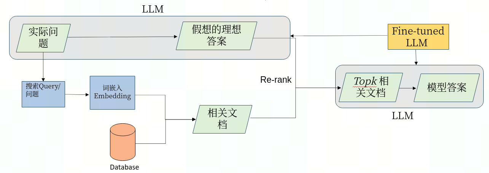
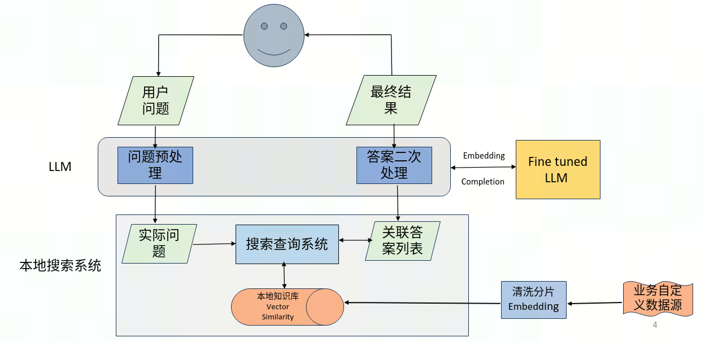

# Wen

Wen 是特定于域的 gpt。与其他解决方案相比，文给出的答案会更加准确。

# 介绍

尽管微调感觉像是更自然的选择（毕竟，数据训练是 GPT 学习所有其他知识的方式），但我们通常不推荐将其作为教授模型知识的方式。微调更适合教授专门的任务或风格，但对于事实回忆来说不太可靠。

打个比方，模型权重就像长期记忆。当你对模型进行微调时，就像为一周后的考试做准备一样。当考试到来时，模型可能会忘记细节，或者记错它从未读过的事实。

相比之下，消息输入就像短期记忆。当您在消息中插入知识时，就像用未完成的笔记参加考试一样。有了笔记，模型更有可能得出正确答案。

# Search System

下图为整个搜索系统的流程图：

# Overall Structure 
整个系统的流程图是在上图的基础上，结合大模型的语言处理能力，增强和用户的交互。

