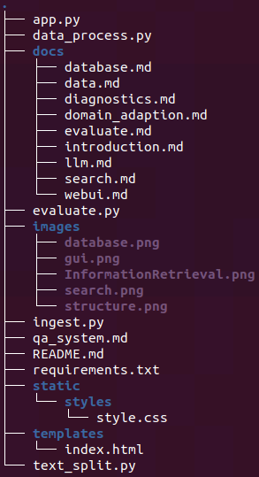
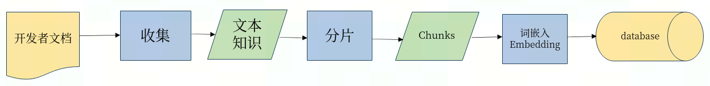
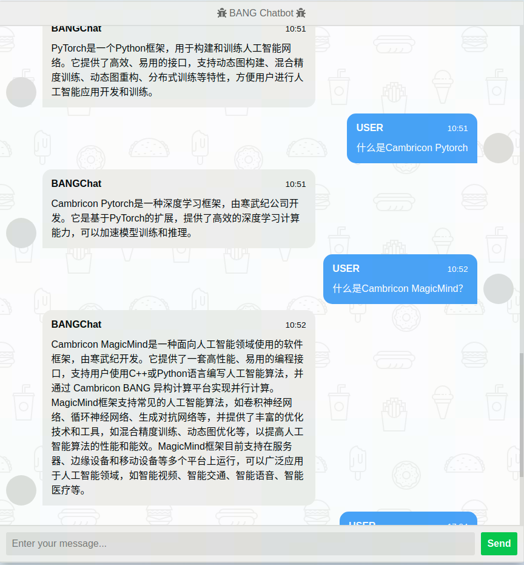

# 基于大语言模型构建知识问答系统

                       目录

                1. 知识问答系统架构
                2. 环境安装
                3. 数据库建立
                4. 文本分割
                5. 模型的训练
                    数据集的制作
                    模型的训练
                6. 系统的评测
                7. webui的展示
                8. 总结
                9. 附录：常见的问题及解决方案


# 1. 知识问答系统架构

## 整体架构
打造 特定领域知识(Domain-specific Knowledge) 问答 系统，具体需求有：

* 通过自然语言问答的形式，和用户交互，同时支持中文和英文。
* 理解用户不同形式的问题，找到与之匹配的答案。可以对答案进行二次处理，比如将关联的多个知识点进行去重、汇总等。
* 支持上下文。有些问题可能比较复杂，或者原始知识不能覆盖，需要从历史会话中提取信息。
* 准确。不要出现似是而非或无意义的回答。

我们提出一种由大模型+搜索的方式，充分利用大模型的思维链的推理能力，将问题的背景文档进行归纳总结，高效、准确的找出其对应的答案，该系统的名字为`wen`。其总体的架构图为：


## 搜索细节

由于寒武纪的开发者文档比较复杂，整个搜索过程我们采用问题的关键字检索和重新排序（retrieve & re-rank）的流程。下图为`Wen`的搜索流程：


我们首先利用大模型得到问题的关键字，然后采用`ElasticSearch`搜索对应的关键字得到相关的文档。
然后通过将相关文档和大模型的假设答案进行对比（采用`cosine相似度`进行排序）。然后根据相似度分数得到最相关的文档（详细细节可见`app.py`中的`query_question`函数）。

ElasticSearch的一个优点是可以轻松添加新文档到索引中，我们还可以将其他数据与向量一起存储。缺点是性能较慢，因为它会将查询嵌入向量与所有存储的嵌入向量进行比较。这具有线性运行时间，在大型（>100k）语料库中可能过慢。

# 2. 环境安装

整个知识问题系统所需要的代码文件均在`wen`（可直接源码下载）的文件夹下。整个代码的目录结构如下：




此外以下的Python包为整个知识问答系统所必须的的安装包
``` 
numpy
tqdm
openai
elasticsearch
flask
```
可以直接运行`wen`库中的`requirements.txt`文件， 即`pip install requirements.txt`进行安装。

另外我们提供一个基于cambricon pytorch ，包括Chinese-LLaMA-Alpaca、FastChat代码及其依赖项的docker镜像
适配过的代码库分别在：
```
/workspace/Chinese-LLaMA-Alpaca_mlu
/workspace/FastChat_mlu
```
# 3 数据库建立

首先我们将寒武纪的开发者文档根据小章节进行拆分， 比如

```
TensorBoard：TensorFlow 的可视化工具包

TensorBoard 提供机器学习实验所需的可视化功能和工具：

 * 跟踪和可视化损失及准确率等指标

 * 可视化模型图（操作和层）

 * 查看权重、偏差或其他张量随时间变化的直方图

 * 将嵌入投射到较低的维度空间

 * 显示图片、文字和音频数据

 * 剖析 TensorFlow 程序

 * 以及更多功能
```

另外也可以将文档API进行分开， 比如：

```
tf.nn.avg_pool

Performs the avg pooling on the input.

tf.nn.avg_pool(
    input, ksize, strides, padding, data_format=None, name=None
)

Each entry in output is the mean of the corresponding size ksize window in value.

Args

- input: Tensor of rank N+2, of shape [batch_size] + input_spatial_shape + [num_channels] if data_format does not start with "NC" (default), or [batch_size, num_channels] + input_spatial_shape if data_format starts with "NC". Pooling happens over the spatial dimensions only.
- ksize: An int or list of ints that has length 1, N or N+2. The size of the window for each dimension of the input tensor.
- strides：An int or list of ints that has length 1, N or N+2. The stride of the sliding window for each dimension of the input tensor.
- padding: A string, either 'VALID' or 'SAME'. The padding algorithm. See here for more information.
- data_format: A string. Specifies the channel dimension. For N=1 it can be either "NWC" (default) or "NCW", for N=2 it can be either "NHWC" (default) or "NCHW" and for N=3 either "NDHWC" (default) or "NCDHW".
- name:	Optional name for the operation.

Returns
A Tensor of format specified by data_format. The average pooled output tensor.
```
通过执行 ``python ./ingest.py`` 中的函数对每个的小章节或者API介绍进行编码，并保存。整个领域知识入库​的过程如下图所示：



# 4. 文本分割
  `text_split.py`文件中提供了根据文本长度和对应的token的长度的不同分割方式，用户可以根据不同的模型要求，选择对应的tokenizer和分割方式。

  * `create_chunk_for_text`函数为根据文本的长度进行分割， 比如我们采用的llama模型要求sequence的长度为2048， 除去prompt其它的部分文字，设置对应的长度为2000。

  * `create_embeddings_for_text`函数为根据文本对应token的长度进行分割， 比如gpt3.5采用的模型要求token的长度为1000。

# 5. 模型的训练
  由上面的架构图可以看出，当搜索系统找不到对应的背景文本时，系统的答案由大模型给出， 所以整个系统的性能的下限由大模型的性能决定。为了提升整个问题系统在寒武纪开发者文档上的性能，我们在寒武纪开发文档进行了模型的训练，下面为整个训练的过程包括：

  * 数据集的制作

  * 模型的训练

## 数据集的制作

### 领域知识的基本处理流程
1. 收集领域知识
2. 数据清洗、数据的分块
3. 问答数据的生成

首先我们下载领域知识的文档，将文档中的水印、版权以及无用的小标题去掉，然后根据小的section对文档进行拆分生成一个文本列表，
然后遍历该文本列表，生成对应的数据集。由于该过程有一些定制化修改，用户可以根据自己的需求调用对应的Python包进行处理。

### 创建一个问答（Q&A）数据集
我们主要使用chatgpt和规则算法的方式， 根据给定的文本生成对应的问答数据。具体的流程如下：

* 加载数据，生成对应的文本信息
* 根据对应的文本生成问答数据

1. 用户可以执行`python ./data_process.py`, 采用chatgpt根据背景文档，生成若干个问答数据， 然后根据问答数据进行筛选。比如对Tensorboard的介绍的问答为：
```
问题：TensorBoard是什么？
回答：TensorBoard是TensorFlow的可视化工具包，提供机器学习实验所需的可视化功能和工具。

问题：TensorBoard可以跟踪和可视化哪些指标？
回答：TensorBoard可以跟踪和可视化损失、准确率等指标。

问题：TensorBoard可以用来查看哪些内容的直方图？
回答：TensorBoard可以用来查看权重、偏差或其他张量随时间变化的直方图。

问题：TensorBoard有哪些功能？
回答：TensorBoard可以可视化模型图、将嵌入投射到较低的维度空间、显示图片、文字和音频数据、剖析TensorFlow程序等，并提供更多功能。
```

2. 根据API接口（结构比较固定），我们这里采用规则算法（根据模板生成），生成对应的QA数据，如：

    ```
    {
        问题: "您能告诉我 Tensorflow的avg_pool 的源代码吗？", 

        回答： "Tensorflow的avg_pool 的函数调用如下：

            tf.nn.avg_pool(input, ksize, strides, padding, data_format=None, name=None)"
    }, 
    
    
    {
        问题: "介绍Tensorflow的avg_pool的参数。", 
        回答： "Tensorflow的avg_pool函数的参数如下：
        
            - input: Tensor of rank N+2, of shape [batch_size] + input_spatial_shape + [num_channels] if data_format does not start with "NC" (default), or         [batch_size, num_channels] + input_spatial_shape if data_format starts with "NC". Pooling happens over the spatial dimensions only.
            - ksize：An int or list of ints that has length 1, N or N+2. The size of the window for each dimension of the input tensor.
            - strides: An int or list of ints that has length 1, N or N+2. The stride of the sliding window for each dimension of the input tensor.
            - padding: A string, either 'VALID' or 'SAME'. The padding algorithm. See here for more information.
            - data_format: A string. Specifies the channel dimension. For N=1 it can be either "NWC" (default) or "NCW", for N=2 it can be either "NHWC" (default) or "NCHW" and for N=3 either "NDHWC" (default) or "NCDHW".
            - name: Optional name for the operation."
    }, 
    ```

## 模型的训练(from source)

## 1. 使用的代码
	- url:  https://github.com/ymcui/Chinese-LLaMA-Alpaca.git
	- commit-id：134d22e6b2bde3cd6745ac146d4a55b6b8cb5ad5
 
## 2. 修改过的依赖：
	- transformers: 4.28.1 
	- accelerate: 0.19.0

使用cambricon pytorch 提供的torch_gpu2mlu.py 对上面2个依赖做过转换，具体的做法青请参数cambricon pytorch 用户手册

## 3. 二次pretrain
### 3.1 数据：

    寒武纪开发者文档的 markdown 版本

### 3.2 训练脚本：scripts/run_pt.sh
dataset_dir 中的文件应当是txt文件（我们使用的markdown格式，txt后缀的文件）
```shell
lr=1e-5
lora_rank=8
lora_alpha=32
lora_trainable="q_proj,v_proj,k_proj,o_proj,gate_proj,down_proj,up_proj"
modules_to_save="embed_tokens,lm_head"
lora_dropout=0.05

pretrained_model=/data/zhaoying/chinese-alpaca-plus-13B
chinese_tokenizer_path=/data/zhaoying/chinese-alpaca-plus-13B/tokenizer.model
dataset_dir=/data/zhaoying/Chinese-LLaMA-Alpaca_mlu/official_doc_only_user_guide
data_cache=temp_data_cache_dir
per_device_train_batch_size=2
per_device_eval_batch_size=2
training_steps=5000
gradient_accumulation_steps=2
output_dir=output_pt_with_wiki
RANDOM=0

deepspeed_config_file=ds_zero2_no_offload.json

deepspeed --include="localhost:0,1,2,3,4,5,6,7" --master_port 1236 run_clm_pt_with_peft.py \
    --deepspeed ${deepspeed_config_file} \
    --model_name_or_path ${pretrained_model} \
    --tokenizer_name_or_path ${chinese_tokenizer_path} \
    --dataset_dir ${dataset_dir} \
    --data_cache_dir ${data_cache} \
    --validation_split_percentage 0.001 \
    --per_device_train_batch_size ${per_device_train_batch_size} \
    --per_device_eval_batch_size ${per_device_eval_batch_size} \
    --do_train \
    --seed $RANDOM \
    --fp16 \
    --max_steps ${training_steps} \
    --lr_scheduler_type cosine \
    --learning_rate ${lr} \
    --warmup_ratio 0.05 \
    --weight_decay 0.01 \
    --logging_strategy steps \
    --logging_steps 10 \
    --save_strategy steps \
    --save_total_limit 3 \
    --save_steps 2000 \
    --gradient_accumulation_steps ${gradient_accumulation_steps} \
    --preprocessing_num_workers 8 \
    --block_size 512 \
    --output_dir ${output_dir} \
    --overwrite_output_dir \
    --ddp_timeout 30000 \
    --logging_first_step True \
    --lora_rank ${lora_rank} \
    --lora_alpha ${lora_alpha} \
    --trainable ${lora_trainable} \
    --modules_to_save ${modules_to_save} \
    --lora_dropout ${lora_dropout} \
    --torch_dtype float16 \
    --gradient_checkpointing \
    --ddp_find_unused_parameters False
```


## 3.3 pretrain 后处理：
### 3.3.1. 格式化：
```shell
cd ${output_dir}
cp ${pretrained_model}/adapter_config.json adapter_config.json
mv pytorch_model.bin adapter_model.bin
```
### 3.3.2. merge checkpoint
```shell
python scripts/merge_llama_with_chinese_lora.py --base_model ${pretrained_model} --lora_model ${output_dir} -output_type huggingface --output_dir ${pt_model_dir}
```

## 4. supervised fine tuning
### 4.1 数据

为上面`创建一个问答（Q&A）数据集`中生成的数据

### 4.2 finetune 脚本：scripts/run_sft.sh
- dataset_dir 下面的是若干json文件，每个json文件是alpaca格式的训练数据，即包含“instruction”， “input”，“output”三元组的列表
- per_device_train_batch_size 和  per_device_eval_batch_size 和 gradient_accumulation_steps 建议根据显存大小调整
- validation_file 是可选的
- save_steps 表示每经过一定step 后save 一次checkpoint，但是这里的checkpoint 是 全量的，包括train state，13B的模型，硬盘用量大约40GB，如果不需要checkpoint，可以将 save_steps 设置的大于training_steps，这种情况下，之后在训练完毕后保存一个lora 权重，不会保存全量的checkpoint，按照下面lora相关参数，13B的模型保存的lora权重大小约2.0GB


```shell
lr=1e-4
lora_rank=8
lora_alpha=32
lora_trainable="q_proj,v_proj,k_proj,o_proj,gate_proj,down_proj,up_proj"
modules_to_save="embed_tokens,lm_head"
lora_dropout=0.05

pretrained_model=../chinese-alpaca-plus-13B-cambricon-pt-6.5-epoch/
chinese_tokenizer_path=$pretrained_model/tokenizer.model
dataset_dir=../clean_qa/
per_device_train_batch_size=2
per_device_eval_batch_size=2
training_steps=256
gradient_accumulation_steps=64
output_dir=output_sft_lora_clean_qa_0706_epoch_20/
peft_model=null
validation_file=../qa_datasets_human_filtered/filtered_qa_alpaca_dataset_after_remove_similar.json
RANDOM=0

deepspeed_config_file=ds_zero2_no_offload.json

deepspeed --include="localhost:0,1,2,3" --master_port 12345 run_clm_sft_with_peft.py \
    --deepspeed ${deepspeed_config_file} \
    --model_name_or_path ${pretrained_model} \
    --tokenizer_name_or_path ${chinese_tokenizer_path} \
    --dataset_dir ${dataset_dir} \
    --validation_split_percentage 0.001 \
    --per_device_train_batch_size ${per_device_train_batch_size} \
    --per_device_eval_batch_size ${per_device_eval_batch_size} \
    --do_train \
    --seed $RANDOM \
    --fp16 \
    --max_steps ${training_steps} \
    --lr_scheduler_type cosine \
    --learning_rate ${lr} \
    --warmup_ratio 0.03 \
    --weight_decay 0 \
    --logging_strategy steps \
    --logging_steps 10 \
    --save_strategy steps \
    --save_total_limit 3 \
    --evaluation_strategy steps \
    --eval_steps 20 \
    --save_steps 1000 \
    --gradient_accumulation_steps ${gradient_accumulation_steps} \
    --preprocessing_num_workers 8 \
    --max_seq_length 512 \
    --output_dir ${output_dir} \
    --overwrite_output_dir \
    --ddp_timeout 30000 \
    --logging_first_step True \
    --lora_rank ${lora_rank} \
    --lora_alpha ${lora_alpha} \
    --trainable ${lora_trainable} \
    --modules_to_save ${modules_to_save} \
    --lora_dropout ${lora_dropout} \
    --torch_dtype float16 \
    --gradient_checkpointing \
    --validation_file ${validation_file} \
    --ddp_find_unused_parameters False

```

### 4.3. sft 后处理：
#### 4.3.1. 格式化：
```shell
	cd ${output_dir}
	cp ${pretrained_model}/adapter_config.json adapter_config.json
	mv pytorch_model.bin adapter_model.bin
```
#### 4.3.2. merge checkpoint
```shell
python scripts/merge_llama_with_chinese_lora.py --base_model ${pt_model_dir} --lora_model ${output_dir} -output_type huggingface --output_dir ${sft_model_dir}
```

## 使用 fastChat 推理：
## 1. 代码
	URL：https://github.com/ymcui/Chinese-LLaMA-Alpaca.git
	commit id：134d22e6b2bde3cd6745ac146d4a55b6b8cb5ad5
## 2. fastChat适配MLU
使用cambricon pytorch 提供的torch_gpu2mlu.py 对上面2个依赖做过转换，具体的做法青请参数cambricon pytorch 用户手册
```
source /torch/venv3/pytorch/bin/activate
export LD_LIBRARY_PATH=/torch/neuware_home/lib64/:LD_LIBRARY_PATH
```

## 3. 启动fastChat服务
```shell
# 下面的命令来自 docs/openai_api.md
python3 -m fastchat.serve.controller &
python3 -m fastchat.serve.openai_api_server --host 0.0.0.0 --port 8001 &
python3 -m fastchat.serve.model_worker  --gpus 0,1 --num-gpus 2  --model-name ${model_name} --model-path ${model_path}
#for example:
#python3 -m fastchat.serve.model_worker  --gpus 0,1 --num-gpus 2  --model-name chinese-alpaca-plus-13B-clean-qa-cambricon-epoch-20  --model-path /projs/AE/zhaoying/projects/Chinese-LLaMA-Alpaca/chinese-alpaca-plus-13B-clean-qa-cambricon-epoch-20
```
# 6. webui的展示
我们这里提供了一个简单的图形界面，在启动`fastchat`服务后，用户只需要运行 `python app.py`，修改对应的处理器的IP以及大语言模型的路径名，然后打开对应的IP即可。 

如下图所示， 我们可以直接提问， 发送问题，chatbot会给出对应的答案。


寒武纪API文档中一些API接口的介绍


寒武纪开发者手册中一些概念的介绍


# 7. 系统的评测
知识问答系统的性能变化较大，比如我们因为参数的设置观察到问答的结果充满幻觉或者错误回答，为次我们搭建了一个系统来

1. 用更系统的方式评测问答的结果
2. 通过评测来更新QA链中参数的设置, 比如分块大小，模型选择等等。

使用着可以运行 `python evaluate.py`, 将根据文字内容进行比较，返回比较正确与错误，最后根据问题的数据，计算整个的准确率。最后会生成一个表格，将问题、背景文本、答案、标准答案、评分对比， 表格的格式如下：

| 问题   |      背景文本      |    答案|  标准答案 |   评分  |
|----------|:-------------:|------:|--------:|------------:|
| TensorBoard是什么？ |  TensorBoard：TensorFlow 的可视化工具包  TensorBoard 提供机器学习实验所 需的可视化功能和工具：* 跟踪和可视化损失及准确率等指标* 可视化模型图（操作和层）* 查看权重、偏差或其他张量随时间变化的直方图 * 将嵌入投射到较低的维度空间 * 显示图片、文字和音频数据 * 剖析 TensorFlow 程序 * 以及更多功能 | TensorBoard是TensorFlow的可视化工具包，提供机器学习实验所需的可视化功能和工具。|TensorBoard是TensorFlow的可视化工具包，提供机器学习实验所需的可视化功能和工具。| 正确|
| 您能告诉我 Tensorflow的avg_pool 的源代码吗？ | tf.nn.avg_pool. Performs the avg pooling on the input. tf.nn.avg_pool(input, ksize, strides, padding, data_format=None, name=None). Each entry in output is the mean of the corresponding size ksize window in value. Args: input: Tensor of rank N+2, of shape [batch_size] + input_spatial_shape + [num_channels] if data_format does not start with "NC" (default), or [batch_size, num_channels] + input_spatial_shape if data_format starts with "NC". Pooling happens over the spatial dimensions only. ksize: An int or list of ints that has length 1, N or N+2. The size of the window for each dimension of the input tensor. strides：An int or list of ints that has length 1, N or N+2. The stride of the sliding window for each dimension of the input tensor. padding: A string, either 'VALID' or 'SAME'. The padding algorithm. See here for more information. data_format: A string. Specifies the channel dimension. For N=1 it can be either "NWC" (default) or "NCW", for N=2 it can be either "NHWC" (default) or "NCHW" and for N=3 either "NDHWC" (default) or "NCDHW". name:	Optional name for the operation.Returns. A Tensor of format specified by data_format. The average pooled output tensor. |   tf.nn.avg_pool(input, ksize, strides, padding, data_format=None, name=None) |tf.nn.avg_pool(input, ksize, strides, padding, data_format=None, name=None)| 正确 |
| 介绍Tensorflow的avg_pool的作用。 | tf.nn.avg_pool. Performs the avg pooling on the input. tf.nnavg_pool(input, ksize, strides, padding, data_format=None, name=None). Each entry in output is the mean of the corresponding size ksize window in value. Args: input: Tensor of rank N+2, of shape [batch_size] + input_spatial_shape + [num_channels] if data_format does not start with "NC" (default), or [batch_size, num_channels] + input_spatial_shape if data_format starts with "NC". Pooling happens over the spatial dimensions only. ksize: An int or list of ints that has length 1, N or N+2. The size of the window for each dimension of the input tensor. strides：An int or list of ints that has length 1, N or N+2. The stride of the sliding window for each dimension of the input tensor. padding: A string, either 'VALID' or 'SAME'. The padding algorithm. See here for more information. data_format: A string. Specifies the channel dimension. For N=1 it can be either "NWC" (default) or "NCW", for N=2 it can be either "NHWC" (default) or "NCHW" and for N=3 either "NDHWC" (default) or "NCDHW". name:	Optional name for the operation.Returns. A Tensor of format specified by data_format. The average pooled output tensor.|    Performs the avg pooling on the input. | Performs the avg pooling on the input. |正确|

# 8. 总结

本系统针对特定领域知识问答系统的问题，进行了方案的优化。不难发现：传统的搜索模式、LLM 的 Fine-Tuning、Prompt Engineer 等方式均存在不同程度的缺陷。该方法将本地知识通过传统搜索框架进行处理，并作为答案的基础数据源。这保证了答案的精准和可靠。同时基于 Prompt Engineering 激发 LLM 的自然语言理解、生成和简单推理能力，对用户的问题预处理、对原始答案进行加工。从而提供了更加智能和友好的交互方式。

经过分析比较后，决定探索 LLM + 搜索 的方式进行处理，并在寒武纪的开发者文档的具体应用场景进行验证。通过在数据集上面的评测，该系统比端到端的大模型的性能提升了20%。相比较与流行的`langchain`系统，本体系采用在特定领域的文档上进行训练，提高系统性能的下限，另外采用训练后模型的答案进行搜索，对对应背景文档的召回率更高。相比`langchain`， 用户也可以更好的扩展。


# 9 附录：常见的问题及解决方案

## 1. 错误答案

如果答案是错误的，这仅仅意味着上下文没有正确传递或没有足够的数量。要解决这个问题：

* 增加返回的文档数量（取前 3 到 5 个） - 并且不要使用非常高的数字，否则信噪比会很低，并且答案将不正确。

* 确保您输入的查询/问题包含足够的上下文来获取相关文档：这对于询问“美国赢得了多少枚奖牌？”是显而易见的。与询问“美国在 2020 年夏季奥运会上赢得了多少枚奖牌？”相比，获取相关内容的可能性较小。因此，查询会极大地影响您的检索。

* 减小块大小。我假设所有文档都很大，您必须将它们分成更小的部分。同样，由于信噪比较低，您需要调整文档块的大小，通常在 500 左右，但需要进行调整。虽然它不会产生巨大的差异，但肯定会提高性能和答案质量。

## 2.答案不完整

在使用开源模型时，这是一个巨大的问题。即使他们接受了指令调整，他们也常常无法正确完成句子。

简单的解决方法是：使用他们接受过培训的提示。这意味着，使用提示：

不会工作
```
根据下面的文章，回答问题。

- 第1条
- 第2条
- 第3条

问题：嘿嘿！怎么了？
回答：
```

而且模型无法正确给出答案的可能性更高。因为模型是在这样的结构上进行训练的：

```
<|提示器|>
 -  操作说明  - -
<|提示器|>
<|文本结束|>
<|助理|>
-- 完成 ---
```
现在，在这样的模型中，使用通用提示符不会有帮助，我们需要更改搜索系统中的提示符：

可能会很好地工作
```
<|提示器|>
根据以下文件，尝试回答问题。不要使用任何其他信息来回答...

文件：
- 文件1
- 文件2
- 文件3
`
问题：嘿嘿！怎么了？
答案：<|提示器|><|endoftext|><|助手|>
```
注意：不同型号会有不同的提示样式。

因此，
* 修复 1：更改提示。通用的不会有帮助。

* 修复 2：使用更好/更大的模型。与 GPT一样，您对搜索系统的默认提示不应该有任何问题，但仍然更改提示将帮助您。

* 修复 3：更改生成参数。尝试调整温度、重复惩罚等等。它们对答案有巨大的影响。
